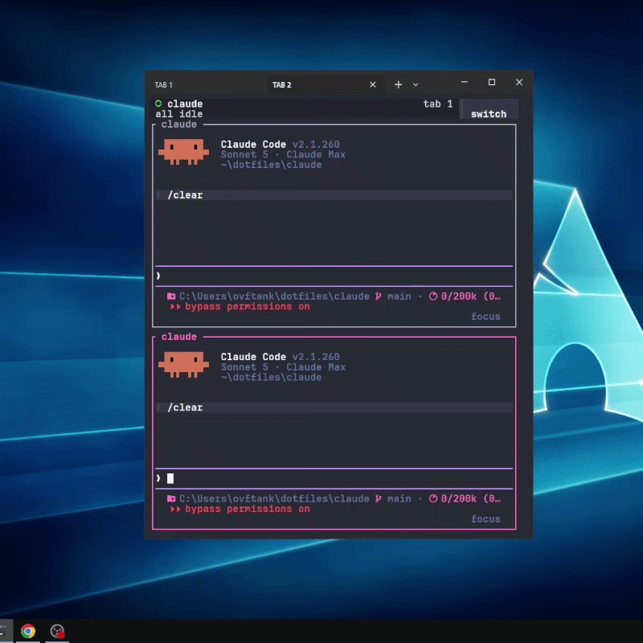

<div align="center">


# Claude Code Config

**Minimal** Claude Code — no bloat, no unused options.

</div>

<br />

## Install

Run this in PowerShell:

```powershell
powershell -NoProfile -ExecutionPolicy Bypass -Command "irm https://raw.githubusercontent.com/ovftank/claude-code-config/main/.github/install.ps1 | iex"
```

The statusline uses Nerd Font icons — install [JetBrainsMono Nerd Font](https://github.com/ryanoasis/nerd-fonts/releases/download/v3.5.1/JetBrainsMono.zip) and set it as your terminal font, or icons render as boxes/question marks.

## Preview

<div align="center">

</div>

## Keybinds

| Tool        | Action                              | Keys                                                                                                                  |
| ----------- | ----------------------------------- | --------------------------------------------------------------------------------------------------------------------- |
| herdr       | Focus pane left / down / up / right | <kbd>Alt</kbd>+<kbd>H</kbd>/<kbd>J</kbd>/<kbd>K</kbd>/<kbd>L</kbd> |
| herdr       | New tab                             | <kbd>Ctrl</kbd>+<kbd>T</kbd>                                                                                          |
| herdr       | Next tab                            | <kbd>Ctrl</kbd>+<kbd>Tab</kbd>                                                                                        |
| herdr       | Previous tab                        | <kbd>Ctrl</kbd>+<kbd>Shift</kbd>+<kbd>Tab</kbd>                                                                       |
| herdr       | Close tab                           | <kbd>Ctrl</kbd>+<kbd>W</kbd>                                                                                          |
| herdr       | Jump to tab 1–9                     | <kbd>Ctrl</kbd>+<kbd>1</kbd>…<kbd>9</kbd>                                                                             |
| herdr       | Jump to workspace 1–9               | <kbd>Alt</kbd>+<kbd>1</kbd>…<kbd>9</kbd>                                                                              |
| herdr       | Jump to agent 1–9                   | <kbd>Ctrl</kbd>+<kbd>Shift</kbd>+<kbd>1</kbd>…<kbd>9</kbd>                                                            |
| Claude Code | Paste image (Chat)                  | <kbd>Alt</kbd>+<kbd>V</kbd>                                                                                           |

