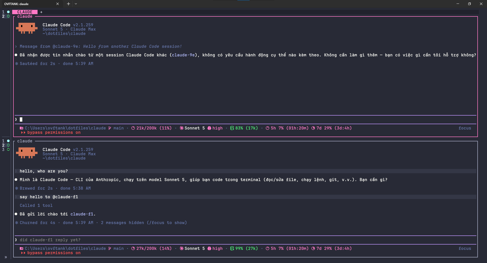

<div align="center">


# Claude Code Config

**Minimal** Claude Code — no bloat, no unused options.

</div>

<br />

## Install

Run this in PowerShell:

```powershell
powershell -NoProfile -ExecutionPolicy Bypass -Command "irm https://raw.githubusercontent.com/ovftank/claude-code-config/main/.github/install.ps1 | iex"
```

The statusline uses Nerd Font icons — install [JetBrainsMono Nerd Font](https://github.com/ryanoasis/nerd-fonts/releases/download/v3.5.1/JetBrainsMono.zip) and set it as your terminal font, or icons render as boxes/question marks.

## Preview

<div align="center">

</div>

